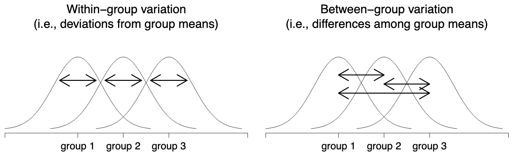

------------------------------------------------------------------------

# One-Way ANOVA

## Learning objectives {#learning-objectives}

1.  tbd

## When to use it? {#when-to-use-it}

When you want to compare two or more sample means. In addition, there is a single quantitative (either interval or ratio) dependent variable and a single categorical independent variables with $i$ independent groups ( $i\geq 2$ ).

## Stating the Hypotheses {#stating-the-hypotheses}

**Null hypothesis**

$H_0:$ There is no difference among the group means.

$H_0:\mu_1 = \mu_2 = \ldots = \mu_i$

where, $\mu_1$ is the population mean for group 1; $\mu_2$ is the population mean for group 2; $\mu_i$ is the population mean for group $i$.

**Alternative hypothesis**

$H_a:$ At least one group differs significantly from the others.

$H_a:\mu_1 \neq \mu_2 = \ldots \neq \mu_i$

------------------------------------------------------------------------

## Assumptions {#assumptions}

1.  data level - the DV should be measured at the continuous level (interval or ratio);
2.  related groups - the IV should consist of at least two categorical, `independent` groups;
3.  independence of observation - there is no relationship between the observations in each group or between the groups themselves;
4.  normality: the DV should be approximately normally distributed for each category of the independent variable;
5.  homogeneity of variance - homogeneity of variance: the standard deviation of the scores on the dependent variable are the same

## Test statistic {#test-statistic}

$$
F = \dfrac{\mbox{mean square between}}{\mbox{mean square error}}
$$ where, $MSb$ is represents the mean square between groups and $MSw$ is the mean square within groups.

SSw = difference between each individual score ( $Yik$ ) from their group mean ( $\bar{Y}k$ )

SSb = difference between the group means ( $\bar{Y}k$ ) and the grand mean ( $\bar{Y}$ )

|                | df              | sum of squares                                                                                                                                                                                                                                                                                                                                                                                                                                                                 | mean squares            | *F*-statistic     |
|----------------|-----------------|--------------------------------------------------------------------------------------------------------------------------------------------------------------------------------------------------------------------------------------------------------------------------------------------------------------------------------------------------------------------------------------------------------------------------------------------------------------------------------|-------------------------|-------------------|
| between groups | *df*~b~ = G - 1 | $$                                                                                                                                                                                                                                                                                                                                                                                                                                                                             
                                                                                                                                                                                                                                                                                                                                                                                                            \displaystyle\sum_{k=1}^G N_k(\bar{Y}_k - \bar{Y})^2                                                    
                                                                                                                                                                                                                                                                                                                                                                                                            $$                                                                                                      | MS~b~ = SS~b~ / *df*~b~ | F = MS~b~ / MS~w~ |
| within groups  | *df*~w~ = N - G | $$                                                                                                                                                                                                                                                                                                                                                                                                                                                                             
                                                                                                                                                                                                                                                                                                                                                                                                            \displaystyle\sum_{k=1}^G \displaystyle\sum_{i = 1}^{N_k} ({Y}_{ik} - \bar{Y}_k)^2                      
                                                                                                                                                                                                                                                                                                                                                                                                            $$                                                                                                      | MS~w~ = SS~w~ / *df*~w~ |                   |
|                |                 |                                                                                                                                                                                                                                                                                                                                                                                                                                                                                |                         |                   |

: (#tab:f-test) APA style ANOVA table



## Sampling distribution

When testing the null hypothesis with the *F*-test, use the [sampling distribution of *F* and *t*](https://statkat.com/sampling-distribution/anova/f-and-t.php). The *F* distribution is used to test if at least one sample mean is different from the others sample means. If the *F* test is significant, further analyses must be performed to verify where the difference lies.

Assume we are comparing 3 sample means ( $\bar{x_1}$, $\bar{x_2}$, and $\bar{x_3}$ ). There are three possible pairwise comparisons; e.g., 1x2, 1x3, and 2x3. The result of the F test only tell us if at least one of the pairwise comparisons is significant. It does not tell us which is which one(s) is(are) significant.

One needs to run t tests on each of the pairwise comparison to find out possible significant differences; this is referred as `post-hoc` analysis.

## Significance

To find out whether the test is significant, compare the observed test statistics (*F* value) with the critical value after considering the **alpha value**, the **type of test** (two-sided, right-sided, or left sided), and the **degrees of freedom**.

-   compare the observed test statistic with the critical value

    -   if the observed *F* value is equal or greater than the critical value, reject the $H_0$ ; or

-   compare the observed $p$ value[^1] with the alpha value (\$\\alpha\$).

    -   if the calculate $p$ value is less than the $\alpha$, reject the $H_0$

[^1]: Value calculated by the statistical package; i.e., jamovi, SPSS or by using an online calculator such as [StatKat](https://statkat.com/online-calculators/critical-f-value-given-alpha.php).

**Critical Value for** $F$ **Statistic**

$$
F = \frac{k-1}{n-k}
$$

where:

$F$ represents the F distribution.

$k$ is the number of treatments (groups).

$n$ is the total number of observations.

------------------------------------------------------------------------

## Confidence Interval for $\mu$

The confidence interval is typically reported along with the statistic (i.e. mean, standard deviation, etc) when performing a significance test. However, it also be used as a [significant test](https://statkat.com/confidence-interval-as-test/one-sample-z-test.php).

Below is the equation used to calculate the CI for the difference in treatment means.

$$
(\bar{x}_{1} - \bar{x}_{2}) \pm t\sqrt{\text{MSE}\left(\frac{1}{n_{1}} + \frac{1}{n_{2}}\right)}
$$

where:

$\bar{x}_{1}$ is the mean of the first sample.

$\bar{x}_{2}$ is the mean of the second sample.

$t$ refers to the $t$ distribution with degrees of freedom equal to $n-k$.

$MSE$ is the mean square error term obtained from the ANOVA table $\left[\frac{SSE}{n-k}\right]$

$n_{1}$ is the number of observations in the first sample.

$n_{2}$ is the number of observations in the second sample.

------------------------------------------------------------------------

## Effect size

There's a different ways to measure the effect size in an ANOVA, but the most commonly used measures are $\eta^2$ (**eta squared**) and partial $\eta^2$. Since for a one-way analysis of variance they're identical, only the $\eta^2$ is provided below. The definition of $\eta^2$ is actually really simple. The values of $SSb$ and $SStot$ are taken from the the ANOVA table.

$$
\begin{align}
\eta^2 = R^2 
&= \dfrac{\mbox{sum of squares between}}{\mbox{sum of squares total}}
\end{align}
$$

One can also use the $\omega^2$ (omega squared), which is arguably the unbiased estimate of the effect size when running the One-Way ANOVA. The equation of the $\omega^2$ is provided below:

$$
\omega^2 = \frac{\mbox{sum of squares between} - \mbox{df between} \times \mbox{mean square error}}{\mbox{sum of squares total} + \mbox{mean square error}}
$$

------------------------------------------------------------------------

## Example

Is the fundamental movement skill total score on the FG-COMPASS[^2] different between children from `low`, `moderate`, and `high` economic class?

[^2]: <http://fgcompass.com>

### Data[^3]

[^3]: This is a made-up data set.

Either type in the data below into your preferred statistical package or [click here](data_les_1anova.csv) to download the csv file.

|     |          |      |
|-----|----------|------|
| Low | Moderate | High |
| 23  | 12       | 25   |
| 33  | 16       | 34   |
| 11  | 22       | 23   |
| 22  | 15       | 33   |
| 22  | 12       | 22   |

: (#tab:data_anova1) Fictitious data comprised of three independent groups.

### Hypotheses

$H_0:$ There is no difference among the `SES` group means.

$H_0:\mu_1 = \mu_2 = \ldots = \mu_i$

$H_a:$ At least one `SES` group differs significantly from the others.

$H_a:\mu_1 \neq \mu_2 = \ldots \neq \mu_i$

### Running the test

I demonstrate below how to test the $H_0$ with the statistical package `jamovi`. We will use a two-sided test with an alpha level set to .05.

#### jamovi

ANOVA \> ANOVA

-   Put your dependent (quantitative) variable in the box below `Dependent Variable` and your independent (grouping) variable in the box below `Fixed Factors`.

##### Output - Descriptive stats

```{r echo=FALSE, comment=NA, paged.print=TRUE}
library(jmv)
library(jmvconnect)
data <- jmvconnect::read(1)
jmv::descriptives(
    formula = `fms scores` ~ ses,
    data = data,
    missing = FALSE,
    median = FALSE,
    min = FALSE,
    max = FALSE,
    skew = TRUE,
    kurt = TRUE,
    sw = TRUE)
```

##### Output - Overall test

```{r echo=FALSE, comment=NA, paged.print=TRUE}
jmv::ANOVA(
    formula = `fms scores` ~ ses,
    data = data,
    effectSize = "omega",
    postHoc = ~ ses)
```

*Interpretation - Overall ANOVA*

Recall that the *F* test only only tells us whether there is a significant difference between at least one of the mean comparisons. By inspecting the $p$ value, we find out that the test was significant at $\alpha = .05$ since the the calculated $p$ value is less than the selected $\alpha$. We need to run further analyses (a.k.a. post-hoc) to verify the level of the difference.

Interpretation - Post Hoc pairwise comparison

By inspecting the `Post Hoc Comparisons` table, we find that the only significant difference is between the `Moderate` and `High` groups with the t statistics = -3.14 and p value = 0.022. When inspecting the means plot, we find that children from `high` SES performed significantly better compared to children from `moderate` SES. None other pairwise comparisons yielded statistical significance.

*Phrasing results*[^4]

[^4]: Click [here](https://www.scribbr.com/apa-style/numbers-and-statistics/#reporting-analysis-of-variance-anovas) to learn more about phrasing results as per the APA Style

You should include:

1.  the test used and any post hoc analyses performed;
2.  the degrees of freedom (between groups, within groups) in parentheses;
3.  the *F* value (also referred to as the *F* statistic);
4.  the $p$ value;
5.  mean and standard deviation - post hoc

For instance:

A one-way ANOVA demonstrated a statistically significant effect of SES group on fundamental movement skill performance, *F*(2, 12) = 4.947, p = 0.027, $\omega^2$ = 0.34). A post hoc Tukey test showed that children from high social economic status performed better ($M$ = 27.40 $SD$ = 5.68) than children from moderate SES ($M$ = 15.40 $SD$ = 4.10) on fundamental movement skill proficiency.

------------------------------------------------------------------------

# ANOVA with repeated-measures

## When to use it?

When you want to compare two or more sample means. In addition, there is a single quantitative (either interval or ratio) dependent variable and a single categorical independent variable with $i$ dependent/related groups ( $i\geq 2$ ).\
Stating the Hypotheses

**Null hypothesis**

$H_0:$ There is no difference among the group means.

$H_0:\mu_1 = \mu_2 = \ldots = \mu_i$

where, $\mu_1$ is the population mean for group 1; $\mu_2$ is the population mean for group 2; $\mu_i$ is the population mean for group $i$.

**Alternative hypothesis**

$H_a:$ At least one group differs significantly from the others.

$H_a:\mu_1 \neq \mu_2 = \ldots \neq \mu_i$

------------------------------------------------------------------------

## Assumptions

1.  data level - the DV should be measured at the continuous level (interval or ratio);
2.  related groups - the IV should consist of at least two categorical, `related groups` or `matched pairs`;
3.  normality: scores on the DV are normally distributed
4.  homogeneity of variance (sphericity) - the variances of the differences between all combinations of related groups must be equal

------------------------------------------------------------------------

## Test statistic

The Test statistic is the same as the ANOVA independent groups, but...

> In a repeated measures ANOVA, the *F*-ratio is calculated in a similar way, but whereas in an independent ANOVA the within-group variability (SS~w~) is used as the basis for the MS~w~ denominator, in a repeated measures ANOVA the SS~w~ is partioned into two parts. As we are using the same subjects in each group, we can remove the variability due to the individual differences between subjects (referred to as SS~subjects~) from the within-groups variability.

Independent ANOVA: SS~error~ = SS~w~ Repeated Measures ANOVA: SS~error~ = SS\~w - SS:sub:\`subjects\~

# References
