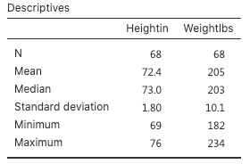
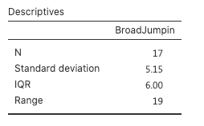
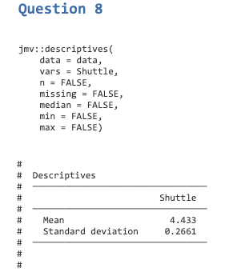
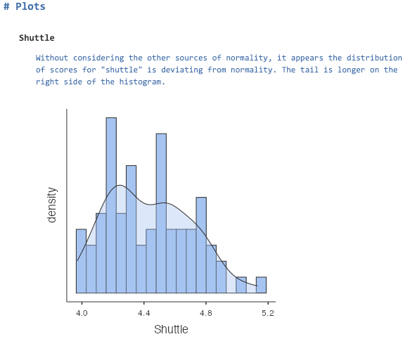
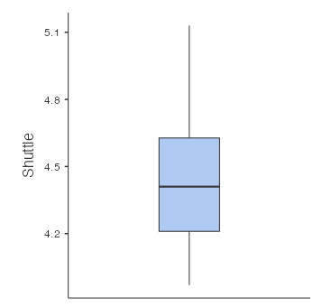

**Other Formats**: [PDF](ds1.pdf) \| [Word](ds1.docx)

## Learning objectives

1.  calculate measures of central tendency and variability in `jamovi`
2.  differentiate between descriptive and inferential statistics
3.  create and interpret histograms and boxplots
4.  understand characteristics of normal and non-normal distributions

## Data set

We will use a modified version of the NFL Combine data set (ref needed). The data set can be downloaded from this link: [https://osf.io/tbgfh/](https://osf.io/kj89u/)

Note that you will be required to create filters when completing some of the required analysis for this assignment. For your convenience, visit the following link to learn how to create filters in `jamovi` - <https://youtu.be/pij0KlFhITw>

------------------------------------------------------------------------

## Questions

Open the data set in `jamovi` and proceed to answer the following questions[^1]:

[^1]: Questions are worth 10 points

### Question 1

**Filter**: create a filter to `Position` so that only `Wide Receivers` (WR) and `Safety` (S) are included in this analysis.

For the variables `Heightin` and `Weightlbs`, compute the following: `mean`, `median`, `standard deviation`, `min`, `max`, and `sample size` (n).



------------------------------------------------------------------------

## Question 2

**Filter**: turn off all filters before proceeding!

Considering the nature of both dependent variables used in `Question 1` and assuming the distribution of scores for both variables are **approximating normality**, which measure of central tendency should be reported (mean, mode, or median)? Explain.

> The mean should be used since both variables are continuous and approximating normality.

------------------------------------------------------------------------

## Question 3

In `question 1`, you calculated the measures of central tendency and variability, which fall under the category of descriptive statistics. Discuss the difference between **descriptive statistics** and **inferential statistics**. More complete answers will receive more points.

> DS --> Allows one to see patterns in the data which is not possible when inspecting the raw data.
>
> IS --> Allows one to make inferences from a sample to a population.

------------------------------------------------------------------------

## Question 4

**Filter**: create a filter to `Position` so that only `Quarterbacks` (QB) are included in this analysis.

Using the variable `BroadJumpin`, calculate the `range`, `standard deviation` and the `IQR` for Quarterbacks (QB) ONLY.



------------------------------------------------------------------------

## Question 5

**Filter**: turn off all filters before proceeding!

In `Question 1`, you were asked to calculate the standard deviation of height (inches) and weight (lbs). Suppose you want to compare the `standard deviations` of `height` and `weight`. How the two standard deviations compare?

> Calculate the coefficient of variation. Based on the calculations below, `weight` varies more (4.92%) compare to `height` (2.49%).

$c_v = \frac{\sigma}{\mu}$

height =

```{r echo=TRUE}
1.8 / 72.4 * 100

```

Weight =

```{r echo=TRUE}
10.1 / 205 * 100

```

------------------------------------------------------------------------

## Question 6

When calculating the sample variance and standard deviation, `jamovi` uses `N-1` in the denominator (see below). In your own words, explain why `N-1` is used instead of `N`.

Standard Deviation equation for the sample:

$\sigma = \sqrt{\frac{\sum (x - \mu)^2}{N-1}}$

Variance equation for the sample:

$s^2 = \frac{\sum (x - \bar{x})^2}{N - 1}$

> N-1 is used because the sample standard deviation calculated with N in the denominator is biased. The variance in the population is always higher than that of the sample. By using N-1, we correct for the inherent difference.

------------------------------------------------------------------------

## Question 7

The `variance` and the `standard deviation` are the two most common measures of variability reported in research manuscripts. Let's say the manuscript you submitted for publication was returned by the editor. The editor-in-chief has asked you to report either the `variance` OR the `standard deviation`. Which one would you pick and why?

> The standard deviation should be used since its value is aligned with the original scale.

------------------------------------------------------------------------

## Question 8

**Filter**: create a filter to `Status` so that **only** `Year 2` is included in this analysis.

The variable "Status" refers to players who were either tested during the first or second year. Run an analysis to calculate the `mean`, and `standard deviation` for the variable `Shuttle`.



------------------------------------------------------------------------

## Question 9

Create a `histogram` for the variable `Shuttle` and add the density line to it.

Provide the histogram create by `jamovi` below and state whether the distribution of scores for `Shuttle` appears to be deviating or approximating normality. In this particular case, disregard other sources of normality (skewness, kurtosis, QQ-plots, Shapiro-Wilk test, etc.).

{width="447"}

------------------------------------------------------------------------

## Question 10

Create a `boxplot` for `Shuttle`. Did the creation of the boxplot reveal any outliers? Explain.



------------------------------------------------------------------------

# Answer sheet

Students completing this assignment for grade may copy the content from the box below and paste it into a word processor (e.g., MS Word, Google Docs, etc.). Then, proceed to answer the proposed questions.

    Institution Name
    Course Name
    Instructor name
    Student Name

    ----

    Question 1

    Answer:

    Any relevant tables/graphs

    ----

    Question 2

    Answer:

    Any relevant tables/graphs

    ----

    Question 3

    Answer:

    Any relevant tables/graphs

    ----

    Question 4

    Answer:

    Any relevant tables/graphs

    ----

    Question 5

    Answer:

    Any relevant tables/graphs

    ----

    Question 6

    Answer:

    Any relevant tables/graphs

    ----

    Question 7

    Answer:

    Any relevant tables/graphs

    ----

    Question 8

    Answer:

    Any relevant tables/graphs

    ----

    Question 9

    Answer:

    Any relevant tables/graphs

    ----

    Question 10

    Answer:

    Any relevant tables/graphs
