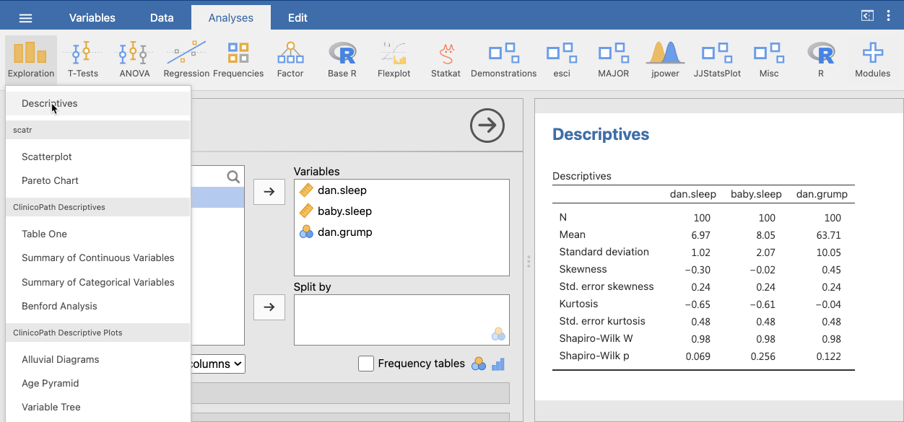
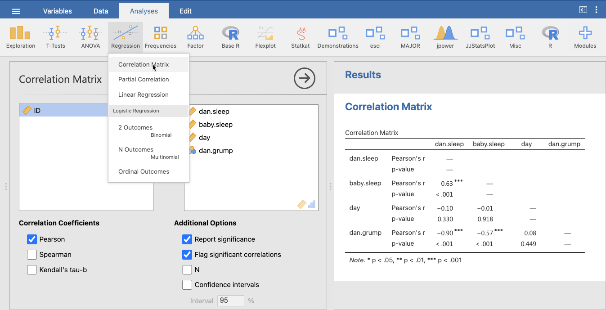
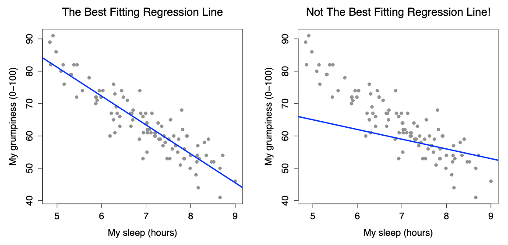
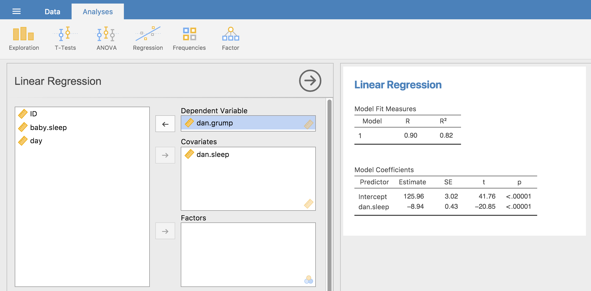
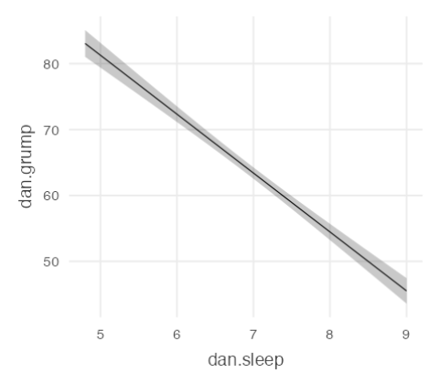
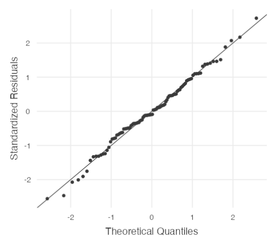
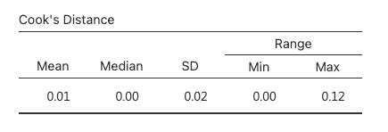

------------------------------------------------------------------------

# Correlation

The Pearson correlation is a measure for the strength and direction of the linear relationship between two variables of at least interval measurement level. @rivkadevries2022. Although there are other types[^1] of correlation coefficients, I will focus on the Pearson Product Moment correlation coefficient in this lesson.

[^1]: Other types of correlation coefficients - <https://bit.ly/3kfNGew>

## Learning objectives {#learning-objectives}

1.  tbd

## When to use it? {#when-to-use-it}

When correlating one quantitative variable ($Yi$) with another quantitative variable ($Xi$).

## Stating the Hypotheses {#stating-the-hypotheses}

**Null hypothesis**

$H_0:$ There is no correlation between variable $x$ and variable $y$ in the population

$H_0:\rho = 0$

where, $\rho$ is the Pearson correlation in the population.

**Alternative hypothesis**

$H_a:$ There is a correlation between variable $x$ and variable $y$ in the population

$H_a: \rho \neq 0$ (two sided)

$H_a: \rho > 0$ (right sided)

$H_a: \rho < 0$ left sided)

------------------------------------------------------------------------

## Assumptions {#assumptions}

-   Both variables are on an interval or ratio level of measurement (quantitative)

-   Data from both variables follow normal distributions

-   Data have no outliers

-   Data is from a random or representative sample

-   You expect a linear relationship between the two variables

Keep in mind that the Pearson coefficient measures the strength of the linear relationship between variable $x$ and $y$. The assumptions above are only important for the significance test and confidence interval.

------------------------------------------------------------------------

## Test statistic {#test-statistic}

$$
t = \dfrac{r \times \sqrt{N - 2}}{\sqrt{1 - r^2}}
$$ where, $r$ is the sample correlation and $n$ is the sample size.

------------------------------------------------------------------------

## Sampling distribution {#sampling-distribution}

To test the significance of the correlation (association) between the two variables, we use the $t$ distribution.[^2]

[^2]: The $t$ distribution - <https://bit.ly/3vNh3dG>

Note on the equation above that $n$ is subtracted by 2 (two variables). This is also known of the degrees of freedom.

------------------------------------------------------------------------

## Significance

To find out whether the test is significant, compare the observed test statistics ($t$ value) with the critical value after considering the **alpha value**, the **type of test** (two-sided, right-sided, or left sided), and the **degrees of freedom**.

-   compare the observed test statistic with the critical value

    -   if the observed $t$ value is equal or greater than the critical value, reject the $H_0$ ; or

-   compare the observed $p$ value[^3] with the alpha value ( $\alpha$ ).

    -   if the calculate $p$ value is less than the $\alpha$, reject the $H_0$

[^3]: Value calculated by the statistical package; i.e., jamovi, SPSS or by using an online calculator such as [StatKat](https://statkat.com/online-calculators/critical-f-value-given-alpha.php).

**Critical Value for** $t$ **Statistic**

You can find the $t$ critical value for a sample data using a $t$ distribution table[^4] or using a online calculator[^5]. In both cases, you will need the alpha level, the degrees of freedom ( $n - 2$; see section \@ref(sampling-distribution)), and the type of test (two sided, right sided, or left sided).

[^4]: $t$ distribution table - <https://bit.ly/3viQqyg>

[^5]: $t$ critical value online calculator - <https://bit.ly/3M3DLVr>

------------------------------------------------------------------------

## Confidence Interval for $\mu$

The confidence interval is typically reported along with the statistic (i.e. mean, standard deviation, etc) when performing a significance test. However, it also be used as a [significant test](https://statkat.com/confidence-interval-as-test/one-sample-z-test.php).

The equation for the confidence interval is a bit complicated and purposefully omitted here. I will show you in section ??? how to calculate it using `jamovi`. The StaKat website[^6] explains the equations in details.

[^6]: Confidence interval for correlation coefficient - <https://bit.ly/38n6sOu>

------------------------------------------------------------------------

## Interpreting a correlation coefficient - effect size

| Correlation coefficient | Correlation strength | Correlation type |
|:------------------------|:---------------------|:-----------------|
| -.7 to -1               | Very strong          | Negative         |
| -.5 to -.7              | Strong               | Negative         |
| -.3 to -.5              | Moderate             | Negative         |
| 0 to -.3                | Weak                 | Negative         |
| 0                       | None                 | Zero             |
| 0 to .3                 | Weak                 | Positive         |
| .3 to .5                | Moderate             | Positive         |
| .5 to .7                | Strong               | Positive         |
| .7 to 1                 | Very strong          | Positive         |

: (#tab:correlation-table) A rough guide to interpreting correlations. Note that I say a *rough* guide. There aren't hard and fast rules for what counts as strong or weak relationships. It depends on the context.

------------------------------------------------------------------------

## Example

We will use a data set called `parenthood` from Navarro and Foxcroft (2019)[^7]. The data set is found under **Data Library** in `jamovi`.[^8] The variables of interest are `dani.sleep`, `baby.sleep`, `dani.grump` , and `day`.

[^7]: \`parenthood data from Navarro and Foxcroft (2019) - <https://bit.ly/3ybECzN>

[^8]: Make sure to install lsj-data from `Modules` in `jamovi.`

### Running the test

I demonstrate below how to test the $H_0$ with the statistical package `jamovi`. We will use a two-sided test with an alpha level set to .05.

#### Descriptive Stats {.unnumbered}

------------------------------------------------------------------------

#### Correlation analysis {.unnumbered}

#### Interpretation

How should you interpret a correlation of, say, $r$ = 0.4? The honest answer is that it really depends on what you want to use the data for, and on how strong the correlations in your field tend to be. In short, the interpretation of a correlation depends a lot on the context. For a rough statement, use Table \@ref(tab:correlation-table).

Refer to Navarro and Foxcroft (2019)[^9] for a detailed interpretation of the results.

[^9]: Interpretation of correlation using the `parenthood` data set - <https://bit.ly/3Kj1DmK>

------------------------------------------------------------------------

# Simple Linear Regression (SLR)

## When to use it?

Simple linear regression, or simply bivariate regression, is an extension of the correlation coefficient. In this context, the dependent variable is the one being predicted whereas the independent variable is the predictor.

## Variables

When running a SLR, it's important to distinguish between the variable of interest ($Y$) and the variable ($X$) that will be used to predict the variable of interest.

The **Responsive Variable** is denoted by $Y$ and called the **variable of interest** or dependent variable. This must be a quantitative variable (interval or ratio).

The **Predictor Variable** is denoted by $X$ and called the **explanatory** or independent variable[^10]. This also must be a quantitative variable (interval or ratio).

[^10]: More than one variable if using multiple predictors.

## Notations and equations

Below are some other important notations related to regression.

| Symbol                       | Meaning                                                                |
|----------------------|--------------------------------------------------|
| $Y$                          | is the response variable                                               |
| $X$                          | is the predictor variable                                              |
| $y_1, y_2, …y_n$             | is the observed values of $Y$                                          |
| $x_1, x_2, …x_n$             | is the observed values of $X$                                          |
| ($x_i, y_1$)                 | are coordinates where $i = 1, …, n$                                    |
| $\beta_0$ \| $\hat{\beta_0}$ | is the population y-intercept \| sample y-intercept                    |
| $\beta_1$ \| $\hat{\beta_1}$ | is the population slope \| sample slope                                |
| $\epsilon_i$                 | is the error or deviation of $y_i$ from the line, $\beta_0+\beta_1x_i$ |

: Notations for Simple Linear Regression

The SRL regression general form is, $$
Y=\beta_0+\beta_1X+\epsilon
$$

For an individual observation, the form is,

$$
y_i=\beta_0+\beta_1x_i+\epsilon_i
$$

Given the equations above, I will use the **Least Square Line** to estimate the parameters from the sample. The LSL "is the line for which the sum of squared errors of predictions for all sample points is the least". @applied

The formulas to calculate least squares estimates are:

Sample Slope

$$
\hat{\beta}_1=\dfrac{\sum (x_i-\bar{x})(y_i-\bar{y})}{\sum (x_i-\bar{x})^2}
$$

Sample Intercept

$$
\hat{\beta}_0=\bar{y}-\hat{\beta}_1\bar{x}
$$

From the two equation above, we derive the Least Squares Regression equation below:

$$
\hat{y}=\hat{\beta}_0+\hat{\beta}_1x
$$

In addition, we can use the LSR line to estimate errors, which are called residuals.

**Residual**

$\hat{\epsilon}_i=y_i-\hat{y}_i$

### Interpretation

Interpreting the **slope** of the regression equation, $\hat{\beta_1}$

$\hat{\beta_1}$ represents the estimated increase in *Y* per unit increase in *X*. Note that the increase may be negative which is reflected when $\hat{\beta_1}$ is negative.

$\hat{\beta_0}$ is the Y-intercept of the regression line. When X = 0 is within the scope of observation, $\hat{\beta_0}$ is the estimated value of *Y* when X = 0.

Note: when X = 0 is not within the scope of the observation, the *Y*-intercept is usually not of interest.

Practice

Suppose we found the following regression equation for weight vs. height.

$$
\text{weight }=-222.5 +5.49\text{ height }
$$

1.  Interpret the slope of the regression equation.
2.  Does the intercept have a meaningful interpretation? If so, interpret the value.

The answer is here.

## Stating the Hypotheses

If the slope of the line is positive, then there is a positive linear relationship, i.e., as one increases, the other increases. If the slope is negative, then there is a negative linear relationship, i.e., as one increases the other variable decreases. If the slope is 0, then as one increases, the other remains constant, i.e., no predictive relationship.

Therefore, we are interested in testing the following hypotheses:

**Null hypothesis**

$F$ test for the complete regression model

-   $H_0:\beta = 0$ (the variance explained by all the independent variables together (the complete model) is 0 in the population)

$t$ test for the individual regression coefficient $b_k$

-   $H_0: \beta = 0$

**Alternative hypothesis**

$F$ test for the complete regression model

-   $H_a: \beta \neq 0$ (not all population regression coefficients are 0)

$t$ test for the individual regression coefficient $\beta$

-   $H_a: \beta \neq 0$ (two sided)

-   $H_a: \beta > 0$ (right sided)

-   $H_0: \beta < 0$ (left sided)

------------------------------------------------------------------------

## Assumptions regression {#assumptions-regression}

There are some assumptions we need to check (other than the general form) to make inferences for the population parameters based on the sample values.

### Linearity {#linearity-reg}

The relationship between X and Y must be linear.

-   Examine the scatterplot of x and y.

### Independence of errors {#independence-of-errors-reg}

There is not a relationship between the residuals and the Y variable; in other words, Y is independent of errors.

-   Examine the scatterplot of "residuals versus fits"; the correlation should be approximately 0. In other words, there should not look like there is a relationship.

### Normality of errors

The residuals must be approximately normally distributed.

-   Check this assumption by examining a normal probability plot; the observations should be near the line. You can also examine a histogram of the residuals; it should be approximately normally distributed.

### Equal variances

The variance of the residuals is the same for all values of X.

-   Check this assumption by examining the scatterplot of "residuals versus fits"; the variance of the residuals should be the same across all values of the x-axis. If the plot shows a pattern (e.g., bowtie or megaphone shape), then variances are not consistent, and this assumption has not been met.

Adapted from Applied Statistics @applied

------------------------------------------------------------------------

## Test statistic

$F$ test for the complete regression model. Refer to the One-Way ANOVA test. **This is only useful in the case of Multiple Regression**

$t$ test for the slope (individual $\beta_k$)

$$
t = \dfrac{b_k}{SE_{b_k}}
$$

where, $SE_{b_k}$ is the estimated standard error of the sample slope.

For one independent variable:

$$
SE_{b_1} = \dfrac{\sqrt{\sum (y_j - \hat{y}_j)^2 / (N - 2)}}{\sqrt{\sum (x_j - \bar{x})^2}} = \dfrac{s}{\sqrt{\sum (x_j - \bar{x})^2}}
$$

with $s$ the sample standard deviation of the residuals, $x_j$ the score of subject $j$ on the independent variable $x$ , and $\bar{x}$ the mean of $x$.

------------------------------------------------------------------------

## Sampling distributions

Refer to the sampling distributions of the $F$ test (One-Way ANOVA) and the $t$ test (Independent-Samples $t$ test).

## Significance

Refer to the steps used for the $F$ test (One-Way ANOVA) and the $t$ test (Independent-Samples $t$ test).

## Confidence Intervals

Refer to the StatKat website[^11] for a detailed explanation. I will show below how to calculate it using `jamovi`.

[^11]: Confidence interval for linear regression - <https://bit.ly/3rVJOUp>

## Effect size

For linear regression we calculate $R^2$ as the effect size. This is the amount of variance in the dependent variable $y$ that is explained by the sample regression equation (the independent variable(s))

## Example

Regression \> Linear Regression

Put your dependent variable in the box below Dependent Variable and your independent variables of interval/ratio level in the box below Covariates.

We will the `parenthood` data set once again.

Before, let's understand the concept of the slop and the intercept. Below is the formula for a straight line:

$$
\hat{y}=\hat{\beta}_0+\hat{\beta}_1x
$$

Where, $\hat{\beta}_0$ is the intercept, $\hat{\beta}_1$ is the slope, and $x$ is the predictor. The intercept is where the line touches the $y$ axis, which in the graph in the left is between 80 and 90. This is the expected value of $Yi$ when $Xi$ is equal to 0. The slop is the tilt of the best fit line.

To run the linear regression, click on `Regression` - `Linear Regression` analysis in jamovi, using the [`parenthood`](https://lsj.readthedocs.io/en/latest/Ch12/_static/data/parenthood.omv) data set.

Then specify `dani.grump` as the `Dependent Variable` and `dani.sleep` as the variable entered in the `Covariates` box. This gives the results shown above.

intercept $\hat{\beta_0}$ = 125.96 (grumpiness index)

slope $\hat{\beta_1}$ = - 8.94 (hours)

With these values, we can create the linear regression equation:

$$
\hat{y} = 125.96 + (-8.94)x
$$

### Interpretation:

The slope: if one increases $Xi$ by 1 unit, then one is decreasing $Yi$ by 8.94. In other words, for each additional hour of sleep, Dani reduce her grumpiness level (points), which in turn will improve her mood.

The intercept: recall that the $a$ is the predicted value of $Yi$ when $Xi$ is equal to 0. Thus, if Dani gets zero hours of sleep ($Xi = 0$), then her grumpiness will reach about ($Yi = 125.96$), which is lot since the scale goes up to 100.

### Assumption Checks

Normality: QQ-plots + Shapiro-Wilk test

Outlier

Interpretation: Values greater than 1 is often considered large and indicates the presence of outlier.

## Answers to questions {#answers-to-questions}

Interpreting coefficients

1.  slope of 5.49 represents the estimated change in weight (in pounds) for every increase of one inch of height.\
2.  A height of zero, or X = 0 is not within the scope of the observation since no one has a height of 0. The value $\hat{\beta_0}$ by itself is not of much interest other than being the constant term for the regression line.

# Multiple Linear Regression

In Multiple Linear Regression, there is one quantitative response and more than one predictor or independent variable.

Multiple regression and multiple correlation---tools that can be used to examine the combined relations between multiple predictors and a dependent variable.

Useful when multiple independent variables can do a better job of predicting a dependent variable than a single independent variable.

Example: using both the rate of fatigue during 30 second cycle test and rate of force development maximal isometric contraction to predict muscle fiber type.

The model will contain the constant or intercept term, $\hat{\beta_0}$, and more than one coefficient, denoted $\hat{\beta_1}, ....,\hat{\beta_k}$ , where $k$ is the number of predictors.

The MLR model will then be:

$$
Y=\beta_0+\beta_1X_1+...+\beta_kX_k
$$

There are several methods by which multiple regressions are performed. 1. Forward selection 2. Backward elimination 3. Stepwise 4. Hierarchical multiple regression

Different methods lead to different orders by which independent variables are added to the model.

Forward

-   Start with a correlation matrix, which is a table with Pearson r correlation coefficients between all X and Y variables.
-   The first X variable added to the model is the one with the highest correlation with the Y variable.
-   Further additions of X variables are added to the model in order of how much each variable can increase the R2 value.
-   They are added in order of how much unique variance they can account for.

Backwards

-   All X variables are initially forced into the model.
-   A computer algorithm eliminates X variables in order of which variables decrease R2 the least when removed.
-   Each removal of an X variable that would not cause a statistically significant decrease in R2 is executed.
-   Stops when further removal of any X variable would significantly decrease R2.

SW

Stepwise multiple regression is the same process as forward selection.

-   However, in stepwise multiple regression, at each step, the algorithm may remove a variable that was previously added if it would not decrease the R2 significantly.

-   This occurs if a variable no longer accounts for a significant portion of unique variance in the model.

Hierarchical multiple regression

-   Allows the researcher/investigator to dictate the order in which X variables are added to the model
-   Used to examine a specific model or hypothesis
-   Example: a researcher decides fat-free mass should be a better predictor of strength than weight despite weight having a slightly higher correlation with strength (refer to tables 9.1 and 9.2)

# References
