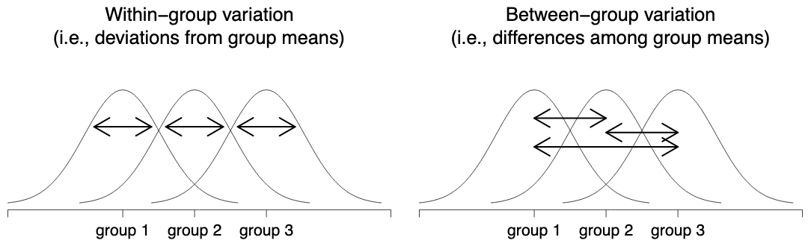

------------------------------------------------------------------------

# One-Way ANOVA

## Readme

Other formats: [PDF](z-test.pdf) \| [HTML](z-test.html)

Hint: use Control+F (Windows) or Command+F (Mac) to search this page

------------------------------------------------------------------------

## Learning objectives {#learning-objectives}

1.  Deciding when to use the z test
2.  

## When to use it? {#when-to-use-it}

When you want to compare two or more sample means. In addition, there is a single quantitative (either interval or ratio) dependent variable and a single categorical independent variables with $i$ independent groups ( $i\geq 2$ ).

## Stating the Hypotheses {#stating-the-hypotheses}

**Null hypothesis**

$H_0:$ There is no difference among the group means.

$H_0:\mu_1 = \mu_2 = \ldots = \mu_i$

where, $\mu_1$ is the population mean for group 1; $\mu_2$ is the population mean for group 2; $\mu_i$ is the population mean for group $i$.

**Alternative hypothesis**

$H_a:$ At least one group differs significantly from the others.

$H_a:\mu_1 \neq \mu_2 = \ldots \neq \mu_i$

------------------------------------------------------------------------

## Assumptions {#assumptions}

1.  normality: scores on the DV are normally distributed
2.  homogeneity of variance: the standard deviation of the scores on the dependent variable are the same
3.  group independence: observations are independent from one another

## Test statistic {#test-statistic}

$$
F = \dfrac{\mbox{mean square between}}{\mbox{mean square error}}
$$ where, $MSb$ is represents the mean square between groups and $MSw$ is the mean square within groups.

|                | df              | sum of squares                                                                     | mean squares            | *F*-statistic     |
|----------------|-----------|---------------|----------------|----------------|
| between groups | *df*~b~ = G - 1 | $$                                                                                 
                                    \displaystyle\sum_{k=1}^G N_k(\bar{Y}_k - \bar{Y})^2                                
                                    $$                                                                                  | MS~b~ = SS~b~ / *df*~b~ | F = MS~b~ / MS~w~ |
| within groups  | *df*~w~ = N - G | $$                                                                                 
                                    \displaystyle\sum_{k=1}^G \displaystyle\sum_{i = 1}^{N_k} ({Y}_{ik} - \bar{Y}_k)^2  
                                    $$                                                                                  | MS~w~ = SS~w~ / *df*~w~ |                   |
|                |                 |                                                                                    |                         |                   |

: (#tab:f-test) APA style ANOVA table



## Sampling distribution

When testing the null hypothesis with the *F*-test, use the [sampling distribution of *F* and *t*](https://statkat.com/sampling-distribution/anova/f-and-t.php). The *F* distribution is used to test if at least one sample mean is different from the others sample means. If the *F* test is significant, further analyses must be performed to verify where the difference lies.

Assume we are comparing 3 sample means ( $\bar{x_1}$, $\bar{x_2}$, and $\bar{x_3}$ ). There are three possible pairwise comparisons; e.g., 1x2, 1x3, and 2x3. The result of the F test only tell us if at least one of the pairwise comparisons is significant. It does not tell us which is which one(s) is(are) significant.

One needs to run t tests on each of the pairwise comparison to find out possible significant differences; this is referred as `post-hoc` analysis.

## Significance

To find out whether the test is significant, compare the observed test statistics (*F* value) with the critical value after considering the **alpha value**, the **type of test** (two-sided, right-sided, or left sided), and the **degrees of freedom**.

-   compare the observed test statistic with the critical value

    -   if the observed *F* value is equal or greater than the critical value, reject the $H_0$ ; or

-   compare the observed $p$ value[^1] with the alpha value (\$\\alpha\$).

    -   if the calculate $p$ value is less than the $\alpha$, reject the $H_0$

[^1]: Value calculated by the statistical package; i.e., jamovi, SPSS or by using an online calculator such as [StatKat](https://statkat.com/online-calculators/critical-f-value-given-alpha.php).

**Critical Value for** $F$ **Statistic**

$$
F = \frac{k-1}{n-k}
$$

where:

$F$ represents the F distribution.

$k$ is the number of treatments (groups).

$n$ is the total number of observations.

------------------------------------------------------------------------

## Confidence Interval for $\mu$

The confidence interval is typically reported along with the statistic (i.e. mean, standard deviation, etc) when performing a significance test. However, it also be used as a [significant test](https://statkat.com/confidence-interval-as-test/one-sample-z-test.php).

Below is the equation used to calculate the CI for the difference in treatment means.

$$
(\bar{x}_{1} - \bar{x}_{2}) \pm t\sqrt{\text{MSE}\left(\frac{1}{n_{1}} + \frac{1}{n_{2}}\right)}
$$

where:

$\bar{x}_{1}$ is the mean of the first sample.

$\bar{x}_{2}$ is the mean of the second sample.

$t$ refers to the $t$ distribution with degrees of freedom equal to $n-k$.

$MSE$ is the mean square error term obtained from the ANOVA table $\left[\frac{SSE}{n-k}\right]$

$n_{1}$ is the number of observations in the first sample.

$n_{2}$ is the number of observations in the second sample.

------------------------------------------------------------------------

## Effect size

There's a different ways to measure the effect size in an ANOVA, but the most commonly used measures are $\eta^2$ (**eta squared**) and partial $\eta^2$. Since for a one-way analysis of variance they're identical, only the $\eta^2$ is provided below. The definition of $\eta^2$ is actually really simple. The values of $SSb$ and $SStot$ are taken from the the ANOVA table.

$$
\eta^2 = SSb / SStot
$$

One can also use the $\omega^2$ (omega squared), which is arguably the unbiased estimate of the effect size when running the One-Way ANOVA.

Arguably, the $\eta^2$ tends to be biased in some cases.

## Doing it in jamovi

Follow the instructions in [this video](https://youtu.be/dE-fQzM86Ew) tutorial to learn how to run a z-test[^2] in jamovi.

[^2]: This can be accomplished by installing a module.

------------------------------------------------------------------------

# One-sample t-test

## Learning objectives

1.  Deciding when to use the t-test
2.  

## When to use it?

-   Comparing a sample mean to population mean
-   Standard deviation of the population is **unknown**
-   Have a single quantitative variable of interval/ratio level

Using, the

## Stating the Hypotheses

**Null hypothesis**

$H_0:\mu = \mu_0$

where, $\mu$ is the population mean and $\mu_0$ refer to some specified value.

**Alternative hypothesis**

$H_1$ two sided: $\mu \ne \mu_0$

$H_1$ right sided: $\mu > \mu_0$

$H_1$ left sided: $\mu < \mu_0$

## Assumptions

-   The data are continuous (not discrete);
-   The data follow the normal probability distribution;
-   Sample is a simple random sample from the population[^3].

[^3]: Each individual in the population has an equal probability of being selected in the sample.

## Test statistic

$$
t = \frac{\bar{X} - \mu}{s/\sqrt{N-1} }
$$ where, $\bar{X}$ is the sample mean, $\mu_0$ is the population mean according to the null hypothesis, $\sigma$ is the population standard deviation, and N is the sample size.

The denominator ???? is the standard error of the mean.

## Sampling distribution

When running the t-test, you will need to use the [*t* sampling distribution](https://statkat.com/sampling-distribution/one-sample-t-test/t.php).

\
To avoid bias, use the *t* distribution with $N-1$ degrees of freedom

------------------------------------------------------------------------

*Suppose that the assumptions of the one sample t test hold, and that the null hypothesis that μ=μ0 is true. Then the sampling distribution of t is the t distribution with N−1 degrees of freedom. That is, most of the time we would find t values close to 0, and only sometimes we would find t values further away from 0. If we find a t value in our actual sample that is far away from 0, this is a rare event if the null hypothesis were true, and is therefore considered evidence against the null hypothesis (t value in rejection region, small p value).* @rivkadevries.

------------------------------------------------------------------------

## Significance

To find out whether the test is significant, compare the observed test statistics (z value) with the critical value after considering the **alpha value**, the **type of test** (two-sided, right-sided, or left sided), and the **degrees of freedom**.

-   compare the observed test statistic with the critical value of z (refer to Table \@ref(tab:critical-values).

    -   if the observed z value is equal or greater than the critical value, reject the $H_0$ ; or

-   compare the observed p-value[^4] with the alpha value ($\alpha$).

    -   if the calculate p-value is less than the $\alpha$, reject the $H_0$

[^4]: Value calculated by the statistical package; i.e., jamovi, SPSS

**Example**

You are interested in comparing a sample mean with a population value and the standard deviation is known.

Assume the following:

1.  z-value = 1.55; alpha = .05; two-sided test

    -   Would you reject or fail to reject the $H_0$? Why?

2.  observed p-value = .03; alpha = .05; two-sided test

    -   Would you reject or fail to reject the $H_0$? Why?

## Confidence Interval for $\mu$

The confidence interval is typically reported along with the statistic (i.e. mean, standard deviation, etc) when performing a significance test. However, it also be used as a [significant test](https://statkat.com/confidence-interval-as-test/one-sample-z-test.php).

Below is the equation used to calculate the CI for the z test

```{=tex}
\begin{equation} 
\bar{X} \pm z^* \times \dfrac{\sigma}{\sqrt{N}}
(\#eq:confidence-interval)
\end{equation}
```
Where $\bar{X}$ is the sample mean and z\* is the critical value based on the desired level of confidence (e.g. = 1.96 for a 95% confidence interval).

## Effect size

**Cohen's d**

The simplest situation to consider is the one corresponding to a one-sample *t*-test. In this case, this is the one sample mean $\bar{X}$ and one (hypothesized) population mean $\mu_0$ to compare it to. Not only that, there's really only one sensible way to estimate the population standard deviation. We just use our usual estimate. Therefore, we end up with the following as the only way to calculate d:

## Example

Is the average VO2-max score of CSUN's varsity soccer players different from $\mu_0$ = 50? Assume that the standard deviation of the varsity soccer players in the population is $\sigma$ = 3.

## Doing it in jamovi

Follow the instructions in [this video](https://youtu.be/dE-fQzM86Ew) tutorial to learn how to run a z-test[^5] in jamovi.

[^5]: This can be accomplished by installing a module.

# Appendices {.unnumbered}

## Rejection regions {.unnumbered}

{#figure1 alt="Rejection regions for the two-sided z-test (left panel) and the one-sided z-test (right panel)"}

## Critical values {.unnumbered}

| **desired** alpha **level** | **two-sided test** | **one-sided test** |
|-----------------------------|--------------------|--------------------|
| 0.1                         | 1.644854           | 1.281552           |
| 0.05                        | 1.959964           | 1.644854           |
| 0.01                        | 2.575829           | 2.326348           |
| 0.001                       | 3.290527           | 3.090232           |

: (#tab:critical-values) Critical values based on desired $\alpha$ level)

# References
