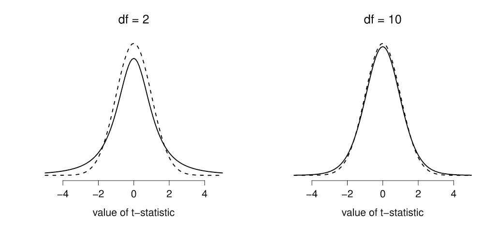

# One-Sample z-test

## Readme

Other formats: [PDF](z-test.pdf) \| [HTML](z-test.html)

Hint: use Control+F (Windows) or Command+F (Mac) to search this page

------------------------------------------------------------------------

## Learning objectives {#learning-objectives}

1.  Deciding when to use the z test
2.  

## When to use it? {#when-to-use-it}

-   Comparing a sample mean to population mean
-   Standard deviation of the population is **known**
-   Have a single quantitative variable of interval/ratio level

## Stating the Hypotheses {#stating-the-hypotheses}

**Null hypothesis**

$H_0:\mu = \mu_0$

where, $\mu$ is the population mean and $\mu_0$ refer to some specified value.

**Alternative hypothesis**

$H_1$ two sided: $\mu \ne \mu_0$

$H_1$ right sided: $\mu > \mu_0$

$H_1$ left sided: $\mu < \mu_0$

## Assumptions {#assumptions}

-   The data are continuous (not discrete);
-   The data follow the normal probability distribution;
-   Population standard deviation $\sigma$ is **known**;
-   Sample is a simple random sample from the population[^1].

[^1]: Each individual in the population has an equal probability of being selected in the sample.

## z test statistic {#z-test-statistic}

$$
z = \dfrac{\bar{X} - \mu_0}{\sigma / \sqrt{N}}
$$ where, $\bar{X}$ is the sample mean, $\mu_0$ is the population mean according to the null hypothesis, $\sigma$ is the population standard deviation, and N is the sample size.

## Sampling distribution

When running the z-test, you will need to use the [sampling distribution of z](https://statkat.com/sampling-distribution/one-sample-z-test/z.php), which is the standard normal distribution.

------------------------------------------------------------------------

*Suppose that the assumptions of the one sample z test hold, and that the null hypothesis that* $\mu$ *=* $\mu_0$ *is true. Then the sampling distribution of z is normal with mean 0 and standard deviation 1 (standard normal). That is, most of the time we would find z values close to 0, and only sometimes we would find z values further away from 0. If we find a z value in our actual sample that is far away from 0, this is a rare event if the null hypothesis were true, and is therefore considered evidence against the null hypothesis (z value in rejection region, small p value)* @rivkadevries2022

------------------------------------------------------------------------

## Significance

To find out whether the test is significant, compare the observed test statistics (z observed) with the z\* critical value given the **alpha value**, the **type of test** (two-sided, right-sided, or left sided), and the **degrees of freedom**.

1.  compare the observed **z statistic** with the [**z\* critical value**](https://bit.ly/3KAVW4d)

    -   if the observed z value is equal or greater than the z\* critical value, reject the $H_0$ ; or

2.  compare the observed *p* value[^2] with the alpha value ($\alpha$).

    -   if the calculate p-value is less than the $\alpha$, reject the $H_0$

[^2]: Value calculated by the statistical package; i.e., jamovi, SPSS

### **Practice Exercise for one sample z test** {#practice-exercise-one-sample-z-test}

You are interested in comparing a sample mean with a population value and the standard deviation is **known**.

Assume the following:

1.  observed z-value = 1.55[^3]; alpha = .05; two-sided test

    -   Would you reject or fail to reject the $H_0$? Why?

2.  observed p-value = .03; alpha = .05; two-sided test

    -   Would you reject or fail to reject the $H_0$? Why?

[^3]: Compare this value with the z\* critical value, given alpha and the type of test.

**Answers in Appendix** \@ref(answer-to-practice-exercises)

## Confidence Interval for $\mu$

The confidence interval is typically reported along with the statistic (i.e. mean, standard deviation, etc) when performing a significance test. However, it also be used as a [significant test](https://statkat.com/confidence-interval-as-test/one-sample-z-test.php).

Below is the equation used to calculate the CI for the z test

```{=tex}
\begin{equation} 
\bar{X} \pm z^* \times \dfrac{\sigma}{\sqrt{N}}
(\#eq:confidence-interval)
\end{equation}
```
Where $\bar{X}$ is the sample mean and z\* is the critical value based on the desired level of confidence (e.g. = 1.96 for a 95% confidence interval).

## Effect size

**Cohen's d**

The simplest situation to consider is the one corresponding to a one-sample *t*-test. In this case, this is the one sample mean $\bar{X}$ and one (hypothesized) population mean $\mu_0$ to compare it to. Not only that, there's really only one sensible way to estimate the population standard deviation. We just use our usual estimate. Therefore, we end up with the following as the only way to calculate d:

## Example

Is the average VO2-max score of CSUN's varsity soccer players different from $\mu_0$ = 50? Assume that the standard deviation of the varsity soccer players in the population is $\sigma$ = 3.

## Doing it in jamovi

First, watch [this video](https://youtu.be/dE-fQzM86Ew) tutorial to learn how to run a z-test[^4] in jamovi.

[^4]: This can be accomplished by installing a module.

Then, input (copy and paste) the data below into jamovi, then run the z-test.

Test the hypothesis that the sample mean (reaction time scores in milliseconds) is different from $\mu_0$ = 284ms. Assume that the standard deviation of the population is known and is equal to $\sigma$ = 20.

|     |     |     |
|-----|-----|-----|
| 252 | 299 | 282 |
| 293 | 333 | 255 |
| 260 | 214 | 287 |
| 337 | 350 | 276 |
| 319 | 396 | 295 |

: (#tab:reaction-time-zdata) Sample data comprised of 15 observations ($N=15$) of reaction time scores[^5]

[^5]: Measured with the Human Benchmark website --\> <https://bit.ly/3JCAmem>

------------------------------------------------------------------------

# One-sample t-test

## Learning objectives

1.  Deciding when to use the t-test
2.  

## When to use it?

-   Comparing a sample mean to population mean
-   Standard deviation of the population is **unknown**
-   Have a single quantitative variable of interval/ratio level

## Stating the Hypotheses

**Null hypothesis**

$H_0:\mu = \mu_0$

where, $\mu$ is the population mean and $\mu_0$ refer to some specified value.

**Alternative hypothesis**

$H_1$ two sided: $\mu \ne \mu_0$

$H_1$ right sided: $\mu > \mu_0$

$H_1$ left sided: $\mu < \mu_0$

## Assumptions

-   The data are continuous (not discrete);
-   The data follow the normal probability distribution;
-   Sample is a simple random sample from the population[^6].

[^6]: Each individual in the population has an equal probability of being selected in the sample.

## Test statistic

$$
t = \frac{\bar{X} - \mu}{s/\sqrt{N} }
$$ where, $\bar{X}$ is the sample mean, $\mu_0$ is the population mean according to the null hypothesis, $\sigma$ is the population standard deviation, and N is the sample size.

The denominator s/√N is the standard error of the mean.

## Sampling distribution

When running the *t*-test, you will need to use the [*t* sampling distribution](https://statkat.com/sampling-distribution/one-sample-t-test/t.php), to compare the *t* observed value with the critical *t* value.

The equation provided above is hypothetical. When estimating the sample statistic, we use the *t* distribution with $N-1$ degrees of freedom to avoid bias. This is because the variance in the population is always larger compared to the sample variance. Using $N-1$ , one is correcting for this inherent bias.

------------------------------------------------------------------------

*Suppose that the assumptions of the one sample t-test hold, and that the null hypothesis* $\mu = \mu_0$ *is true. Then the sampling distribution of t is the t distribution with* $N-1$ *degrees of freedom. That is, most of the time we would find t values close to 0, and only sometimes we would find t values further away from 0. If we find a t value in our actual sample that is far away from 0, this is a rare event if the null hypothesis were true, and is therefore considered evidence against the null hypothesis (t value in rejection region, small p value) @rivkadevries2022.*

------------------------------------------------------------------------

{alt="(#fig:null-vs-ho-t) Rejection regions for the two-sided z-test (left panel) and the one-sided z-test (right panel)"}

## Significance

To find out whether the test is significant, compare the observed test statistics (*t* value) with the critical value after considering the **alpha value**, the **type of test** (two-sided, right-sided, or left sided), and the **degrees of freedom**.

1.  compare the observed test statistic with the [*t\** critical value](https://bit.ly/3O8ysWi)

    -   if the observed *t* value is equal or greater than the *t\** critical value, reject the $H_0$ ; or

2.  compare the observed p-value[^7] with the alpha value ($\alpha$).

    -   one can [calculate](https://bit.ly/3M3aOsO) the p-value given the ***t*** **observed**, **degrees of freedom**, and the **type of test**

        -   if the calculate p-value is less than the $\alpha$, reject the $H_0$

[^7]: Value calculated by the statistical package; i.e., jamovi, SPSS. Alternative, you can [calculate](https://bit.ly/3M3aOsO) the p-value given the t observed value, the degrees of freedom, and the type of the test.

### **Practice exercise one-sample *t* test** {#practice-exercise-one-sample-t-test}

You are interested in comparing a sample mean with a population value and the standard deviation is **unknown**.

Assume the following:

1.  *observed t* value = 3.22; df = 12; alpha = .05; two-sided test[^8]

    -   Would you reject or fail to reject the $H_0$? Why?

2.  using the information above, calculate the p-value

    -   Would you reject or fail to reject the $H_0$? Why?

[^8]: Calculate the critical *t* given significance level and *df --\> <https://bit.ly/3M3DLVr>*

**Answers in Appendix** \@ref(answer-to-practice-exercises)

## Confidence Interval for $\mu$

The confidence interval is typically reported along with the statistic (i.e. mean, standard deviation, etc) when performing a significance test. However, it also be used as a [significant test](https://statkat.com/confidence-interval-as-test/one-sample-z-test.php).

Below is the equation used to calculate the CI for the z test

```{=tex}
\begin{equation} 
\bar{X} \pm z^* \times \dfrac{\sigma}{\sqrt{N}}
(\#eq:confidence-interval)
\end{equation}
```
Where $\bar{X}$ is the sample mean and z\* is the critical value given the desired level of confidence (e.g. = 1.96 for a 95% confidence interval).

## Effect size

**Cohen's d**

The simplest situation to consider is the one corresponding to a one-sample *t*-test. In this case, this is the one sample mean $\bar{X}$ and one (hypothesized) population mean $\mu_0$ to compare it to. Not only that, there's really only one sensible way to estimate the population standard deviation. We just use our usual estimate. Therefore, we end up with the following as the only way to calculate d:

## Example

Is the average VO2-max score of CSUN's varsity soccer players different from $\mu_0$ = 50? Assume that the standard deviation of the varsity soccer players in the population is $\sigma$ = 3.

## Doing it in jamovi

Follow the instructions in [this video](https://youtu.be/dE-fQzM86Ew) tutorial to learn how to run a z-test[^9] in jamovi.

[^9]: This can be accomplished by installing a module.

# Appendices {.unnumbered}

## Rejection regions {.unnumbered}

{#figure1 alt="Rejection regions for the two-sided z-test (left panel) and the one-sided z-test (right panel)"}

## Critical values {.unnumbered}

| **desired** alpha **level** | **two-sided test** | **one-sided test** |
|-----------------------------|--------------------|--------------------|
| 0.1                         | 1.644854           | 1.281552           |
| 0.05                        | 1.959964           | 1.644854           |
| 0.01                        | 2.575829           | 2.326348           |
| 0.001                       | 3.290527           | 3.090232           |

: (#tab:critical-values) Critical values based on desired $\alpha$ level)

## Answer to practice exercises {#answer-to-practice-exercises}

**Practice exercise**: \@ref(practice-exercise-one-sample-z-test)

Answer 1: When alpha = 0.05 and the test is two sided, the critical *z* value is equal to *z\** = 1.96. Reject the null hypothesis if your observed *z* value is equal to or smaller than -1.96, or equal to or larger than 1.96 Thus, we fail to reject the $H_0$ since the observed z value (1.55) is less than the z\* critical value (1.96) given $\alpha$ = .05 and a two-sided @rivkadevries2022.

Answer 2: When *z* = 1.55, the two sided *p* value is equal to 0.121. That is, the probability of finding the observed *z* value of 1.55 or a more extreme value, if the null hypothesis were true, is equal to 0.121. Thus, reached the same conclusion when using the p-value. The p-value (.121) is largen than the $\alpha$ value (.05).

------------------------------------------------------------------------

**Practice exercise**: \@ref(practice-exercise-one-sample-t-test)

**Answer 1**: When alpha = 0.05, df = 12, and the test is two sided, the critical *t* value is equal to *t\** = 2.179. Since the observed *t* value (3.223) is larger than 2.179, we reject the $H_0$ and conclude and the $H_1$ is the most attractive option

**Answer 2**: When *t* = 3.223 and df = 12, the two sided *p* value is equal to 0.00731. That is, the probability of finding the observed *t* value of 3.223 or a more extreme value, if the null hypothesis were true, is equal to 0.00731. Thus, one would reject the $H_0$ in this case .

# References {#references}
