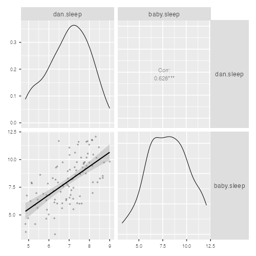
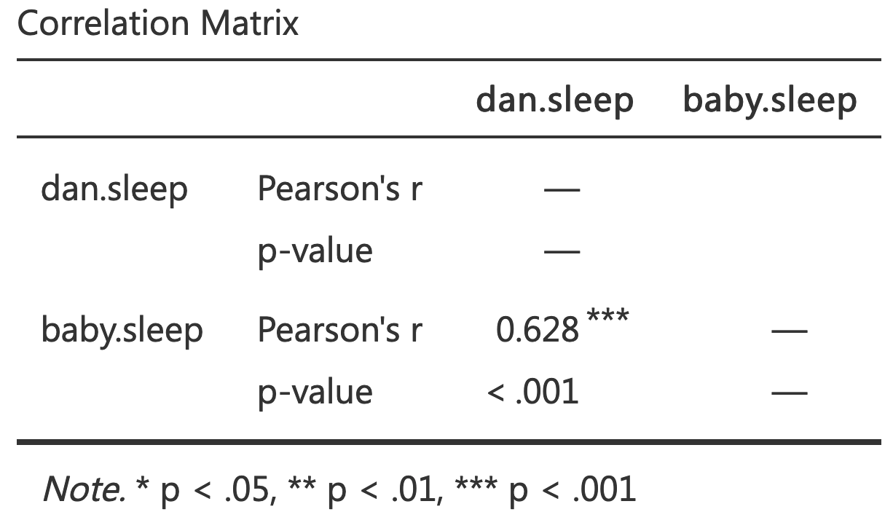

`Credits`

This tutorial is an adaptation of a chapter from *Learning statistics with jamovi: A tutorial for psychology students and other beginners* @daniellenvarro2019

The purpose in this tutorial is to introduce the concept of **correlation** and **linear regression**. These are the standard tools that statisticians rely on when analyzing the relationship between continuous predictors and continuous outcomes.

# Learning objectives {#learning-objectives}

1.  Identify variables from a research question statement
2.  Formulate hypotheses from a research question statement
3.  Identify the appropriate statistical procedure to test the formulated hypothesis
4.  Conduct statistical analysis in `jamovi`
5.  Interpret the results of the data analysis
6.  Create tables and figures to illustrate the findings
7.  Prepare a research report

# Correlation

# Data {#data}

{width="500"}

## Data set

to be added

# References
